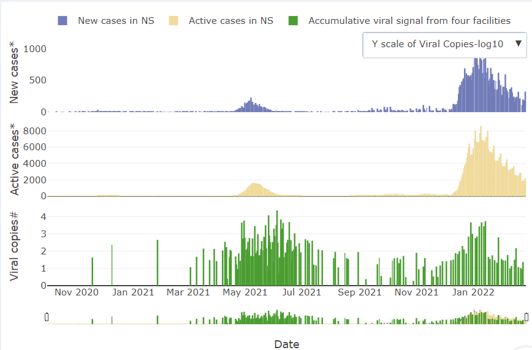

```{r setup, include=FALSE}
knitr::opts_chunk$set(echo = FALSE)
```

Web application using wastewater data to show Nova Scotia Covid-19 trends.

The Web application was created using RShiny (@shiny) and graphics were created using  the plotly package (@plotly).  
<br>


```{r, echo= FALSE, layout="l-page", fig.cap = "Link to Live Site: https://cwrs.shinyapps.io/public_dashboard/" }
knitr::include_app(" https://cwrs.shinyapps.io/public_dashboard/",
  height = "600px")
```


Preview: 

```{r, echo= FALSE}

```


# Acknowledgments {.appendix}

We'd like to thank the following funding sources for making this work possible: 
